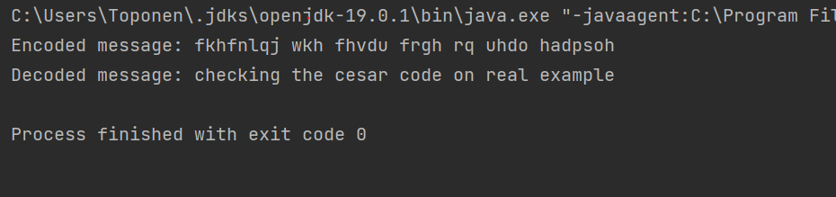
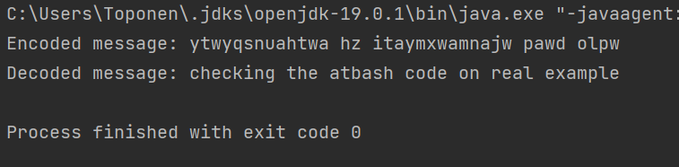

---
## Front matter
lang: ru-RU
title: Лабораторная работа №1
subtitle: Шифры простой замены
author:
  - Топонен Н. А.
institute:
  - Российский университет дружбы народов, Москва, Россия
date: 18 сентября 2023

## i18n babel
babel-lang: russian
babel-otherlangs: english

## Formatting pdf
toc: false
toc-title: Содержание
slide_level: 2
aspectratio: 169
section-titles: true
theme: metropolis
header-includes:
 - \metroset{progressbar=frametitle,sectionpage=progressbar,numbering=fraction}
 - '\makeatletter'
 - '\beamer@ignorenonframefalse'
 - '\makeatother'
---

# Информация

## Докладчик

:::::::::::::: {.columns align=center}
::: {.column width="70%"}

  * Топонен Никита Андреевич
  * студент Российского университет дружбы народов
  * [1132236933@rudn.ru](mailto:1132236933@rudn.ru)
  * <https://github.com/natoponen>

:::
::: {.column width="30%"}


:::
::::::::::::::

# Вводная часть

## Цель работы

- Познакомиться с шифрами простой замены
- Реализовать шифр Цезаря
- Реализовать шифр Атбаш

## Задание

- Реализовать шифр Цезаря с произвольным ключом <i>k</i>.
- Реализовать шифр Атбаш.

# Теоретическое введение

## Шифр Цезаря 

- Шифр Цезаря — это вид шифра подстановки, в котором каждый символ в открытом тексте заменяется символом, находящимся на некотором постоянном числе позиций левее или правее него в алфавите.
- Например, в шифре со сдвигом вправо на 3, А была бы заменена на Г, Б станет Д, и так далее.

## Шифр Атбаш

- Шифр Атбаш --- простой шифр подстановки для алфавитного письма.
- Правило шифрования состоит в замене i-й буквы алфавита буквой с номером <i>n - i + 1</i>, где <i>n</i> — число букв в алфавите.

# Выполнение лабораторной работы

## Шифр Цезаря

```java
for (char character : message.toCharArray()) {
  if (character != ' ') {
    // ASCII код буквы - ASCII код а
    int originalAlphabetPosition = character - 'a';
    // Находим смещение в зависимости от offset
    int newAlphabetPosition = 
      (originalAlphabetPosition + offset) % 26;
    // Достаем символ ASCII, прибавляя смещение
    char newCharacter = (char) ('a' + newAlphabetPosition);
    result.append(newCharacter);
  } else {
    result.append(character);
  }
}
```

## Шифр Цезаря. Результат



## Шифр Атбаш

```java
    private static final HashMap<Character, Character> ATBASH_TABLE = 
      new HashMap<>(){{
        put('a', ' '); put('b', 'z'); put('c', 'y'); put('d', 'x'); 
        put('e', 'w'); put('f', 'v'); put('g', 'u'); put('h', 't'); 
        put('i', 's'); put('j', 'r'); put('k', 'q'); put('l', 'p');
        put('m', 'o'); put('n', 'n'); put('o', 'm'); put('p', 'l'); 
        put('q', 'k'); put('r', 'j'); put('s', 'i'); put('t', 'h'); 
        put('u', 'g'); put('v', 'f'); put('w', 'e'); put('x', 'd');
        put('y', 'c'); put('z', 'b'); put(' ', 'a');
    }};
```

## Шифр Атбаш

```java
    public static String atbash(String message)
    {
        StringBuilder result = new StringBuilder();
        
        for(char letter : message.toCharArray()) {
            result
              .append(Character
                .toLowerCase(ATBASH_TABLE.get(letter)));
        }

        return result.toString();
    }
```

## Шифр Цезаря. Результат



## Выводы

- Познакомился с шифрами простой замены
- Реализовал шифр Цезаря с произвольным ключом
- Реализовал шифр Атбаш