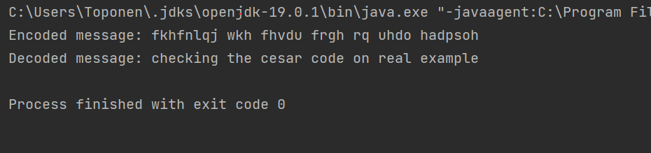
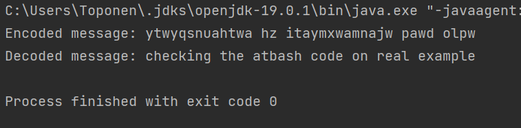

---
## Front matter
title: "Отчет по лабораторной работе по предмету Математические основы защиты информации и информационной безопасности"
subtitle: "Лабораторная работа №1. Шифры простой замены"
author: "Никита Андреевич Топонен"

## Generic otions
lang: ru-RU
toc-title: "Содержание"

## Bibliography
bibliography: bib/cite.bib
csl: pandoc/csl/gost-r-7-0-5-2008-numeric.csl

## Pdf output format
toc: true # Table of contents
toc-depth: 2
lof: true # List of figures
lot: true # List of tables
fontsize: 12pt
linestretch: 1.5
papersize: a4
documentclass: scrreprt
## I18n polyglossia
polyglossia-lang:
  name: russian
  options:
	- spelling=modern
	- babelshorthands=true
polyglossia-otherlangs:
  name: english
## I18n babel
babel-lang: russian
babel-otherlangs: english
## Fonts
mainfont: PT Serif
romanfont: PT Serif
sansfont: PT Sans
monofont: PT Mono
mainfontoptions: Ligatures=TeX
romanfontoptions: Ligatures=TeX
sansfontoptions: Ligatures=TeX,Scale=MatchLowercase
monofontoptions: Scale=MatchLowercase,Scale=0.9
## Biblatex
biblatex: true
biblio-style: "gost-numeric"
biblatexoptions:
  - parentracker=true
  - backend=biber
  - hyperref=auto
  - language=auto
  - autolang=other*
  - citestyle=gost-numeric
## Pandoc-crossref LaTeX customization
figureTitle: "Рис."
tableTitle: "Таблица"
listingTitle: "Листинг"
lofTitle: "Список иллюстраций"
lotTitle: "Список таблиц"
lolTitle: "Листинги"
## Misc options
indent: true
header-includes:
  - \usepackage{indentfirst}
  - \usepackage{float} # keep figures where there are in the text
  - \floatplacement{figure}{H} # keep figures where there are in the text
---

# Цель работы

Цель работы --- познакомиться с шифрами простой замены, а также реализовать шифр Цезаря и шифр Атбаш.

# Задание

1. Реализовать шифр Цезаря с произвольным ключом <i>k</i>.
2. Реализовать шифр Атбаш.

# Теоретическое введение

## Шифр Цезаря 

Шифр Цезаря — это вид шифра подстановки, в котором каждый символ в открытом тексте заменяется символом, находящимся на некотором постоянном числе позиций левее или правее него в алфавите. Например, в шифре со сдвигом вправо на 3, А была бы заменена на Г, Б станет Д, и так далее.

Шифр назван в честь римского полководца Гая Юлия Цезаря, использовавшего его для секретной переписки со своими генералами.

Шифрование с использованием ключа <i>k</i> = 3. Буква «A» «сдвигается» на три буквы вперёд и становится буквой «D», буква «Z», перемещённая на три буквы вперёд, становится буквой «B», и так далее.

## Шифр Атбаш

Шифр Атбаш --- простой шифр подстановки для алфавитного письма. Правило шифрования состоит в замене i-й буквы алфавита буквой с номером <i>n - i + 1</i>, где <i>n</i> — число букв в алфавите.

Впервые встречается в древнееврейском тексте Библии / Танаха.

Таким образом, латинский алфавит с пробелом будет сопоставляться следующим образом: букве «A» соответствует « », буква «B» соответствует букве «Z», буква «Z» соответствует букве «B», и « » соответствует «A».

# Выполнение лабораторной работы

## Шифр Цезаря

В рамках данной лабораторной работы я реализовал шифрование шифром Цезаря на языке Java для латинского алфавита без учета пробела в алфавите. Ниже приведен код с подробными комментариями:

```java
public class Cesar {
    public static void main(String[] args) {
        // Подготовливаем сообщение
        String testMessage = "checking the cesar code on real example";

        // Кодируем сообщение с k = 3
        String cesarEncodedTestMessage = encode(testMessage, 3);

        // Выводим зашифрованное сообщение для проверки
        System.out.println("Encoded message: " + cesarEncodedTestMessage);

        // Расшифровываем сообщение
        String decodedTestMessage = decode(cesarEncodedTestMessage, 3);

        // Проверяем, что расшифрованное сообщение соответствует ожиданиям
        System.out.println("Decoded message: " + decodedTestMessage);
    }

    // ===================================================================
    // Implementation
    // ===================================================================

    // Шифрование сообщения шифром Цезаря с произвольным сдвигом offset
    private static String encode(String message, int offset) {
        // Проверяем, что сдвиг не выходит за пределы алфавита
        // Если сдвиг не попадает в рамки алфавита, возвращаем 
        // сообщение об ошибке
        if (offset < 1 || offset > 26) {
            return "Could not encode your message. Please check offset.";
        }

        StringBuilder result = new StringBuilder();

        // В цикле шифруем сообщение с помощью сдвига по таблице ASCII
        for (char character : message.toCharArray()) {
            // Пробелы не шифруются
            if (character != ' ') {
                // ASCII код буквы - ASCII код а
                int originalAlphabetPosition = character - 'a';
                // Находим смещение в зависимости от offset
                int newAlphabetPosition = 
                  (originalAlphabetPosition + offset) % 26;
                // Достаем символ ASCII, прибавляя смещение
                char newCharacter = (char) ('a' + newAlphabetPosition);
                // Записываем в результат
                result.append(newCharacter);
            } else {
                result.append(character);
            }
        }

        return result.toString();
    }

    // Расшифровываем сообщения, зашифрованное шифром Цезаря, 
    // с заранее известным offset
    private static String decode(String encodedMessage, int offset) {
        // Сдвигаем так, чтобы алфавит оказался в начальном положении
        return encode(encodedMessage, 26 - (offset % 26));
    }
}
```

Результаты выполнения программы на иллюстрации (рис. @fig:001).

{#fig:001 width=70%}

## Шифр Атбаш

В рамках данной лабораторной работы я реализовал шифрование шифром Атбаш на языке Java для латинского алфавита с пробелом в алфавите. Ниже приведен код с подробными комментариями:

```java
import java.util.HashMap;

public class Atbash {
    public static void main(String[] args) {
        // Подготовливаем сообщение
        String testMessage = "checking the atbash code on real example";

        // Кодируем сообщение
        String atbashEncodedTestMessage = atbash(testMessage);

        // Выводим зашифрованное сообщение для проверки
        System.out.println("Encoded message: " + atbashEncodedTestMessage);

        // Расшифровываем сообщение
        String decodedTestMessage = atbash(atbashEncodedTestMessage);

        // Проверяем, что расшифрованное сообщение соответствует ожиданиям
        System.out.println("Decoded message: " + decodedTestMessage);
    }

    // ====================================================================
    // Implementation
    // ====================================================================

    // Таблица соответствия латинского алфавита с пробелом с шифром Атбаш
    private static final HashMap<Character, Character> ATBASH_TABLE = 
      new HashMap<>(){{
        put('a', ' '); put('b', 'z'); put('c', 'y'); put('d', 'x'); 
        put('e', 'w'); put('f', 'v'); put('g', 'u'); put('h', 't'); 
        put('i', 's'); put('j', 'r'); put('k', 'q'); put('l', 'p');
        put('m', 'o'); put('n', 'n'); put('o', 'm'); put('p', 'l'); 
        put('q', 'k'); put('r', 'j'); put('s', 'i'); put('t', 'h'); 
        put('u', 'g'); put('v', 'f'); put('w', 'e'); put('x', 'd');
        put('y', 'c'); put('z', 'b'); put(' ', 'a');
    }};

    // Шифрование и расшифрование сообщения шифром Атбаш
    public static String atbash(String message)
    {
        StringBuilder result = new StringBuilder();

        // В цикле находим соответствующий символ в таблице 
        // и записываем в результат
        for(char letter : message.toCharArray()) {
            result
              .append(Character
                .toLowerCase(ATBASH_TABLE.get(letter)));
        }

        return result.toString();
    }
}
```

Результаты выполнения программы на иллюстрации (рис. @fig:002).

{#fig:002 width=70%}

# Выводы

В рамках данной лабораторной работы я познакомился с шифрами простой замены, такими как шифр Цезаря и шифр Атбаш. Также реализовал оба шифра на языке Java.

# Список литературы{.unnumbered}