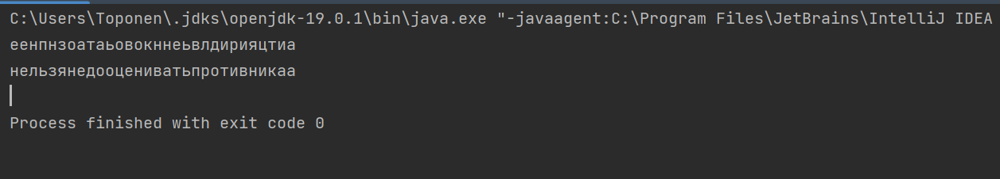
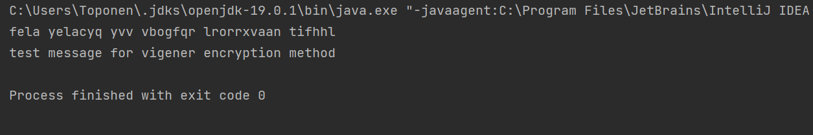

---
## Front matter
lang: ru-RU
title: Лабораторная работа №2
subtitle: Шифры перестановки
author:
  - Топонен Н. А.
institute:
  - Российский университет дружбы народов, Москва, Россия
date: 30 сентября 2023

## i18n babel
babel-lang: russian
babel-otherlangs: english

## Formatting pdf
toc: false
toc-title: Содержание
slide_level: 2
aspectratio: 169
section-titles: true
theme: metropolis
header-includes:
 - \metroset{progressbar=frametitle,sectionpage=progressbar,numbering=fraction}
 - '\makeatletter'
 - '\beamer@ignorenonframefalse'
 - '\makeatother'
---

# Информация

## Докладчик

:::::::::::::: {.columns align=center}
::: {.column width="70%"}

  * Топонен Никита Андреевич
  * студент Российского университет дружбы народов
  * [1132236933@rudn.ru](mailto:1132236933@rudn.ru)
  * <https://github.com/natoponen>

:::
::: {.column width="30%"}


:::
::::::::::::::

# Вводная часть

## Цель работы

- Познакомиться с шифрами перестановки

## Задание

1. Реализовать маршрутное шифрование.
2. Реализовать шифрование с помощью решеток.
3. Реализовать шифрование с помощью таблицы Виженера.

# Теоретическое введение

## Маршрутное шифрование

- Открытый текст последовательно разбивается на части (блоки) с длиной, равной произведению mn.
- Блок вписывается построчно в таблицу размерности m×n.
- Криптограмма получается выписыванием букв из таблицы в соответствии с некоторым маршрутом.
- Маршрут вместе с числами m и n составляет ключ шифра

## Шифрование с помощью решеток

- Выбирается натуральное число k > 1, и квадрат размерности k×k построчно заполняется числами 1, 2, ..., k.
- Квадрат поворачивается по часовой стрелке на 90° и размещается вплотную к предыдущему квадрату.
- Далее из большого квадрата вырезаются клетки с числами от 1 до k2, для каждого числа одна клетка.
- Шифрование происходит путем вписывания букв в прорези и поворотом решетки на 90° по часовой стрелке.

## Таблица Виженера

- Шифрования открытый текст разбивается на блоки некоторой длины n.
- Ключ – последовательность из n натуральных чисел: a1,a2,...,an.
- В каждом блоке первая буква циклически сдвигается вправо по алфавиту на a1 позиций, вторая буква – на a2 позиций, ..., последняя – на an шагов.

# Выполнение лабораторной работы

## Маршрутное шифрование

```java
    private static String encrypt(int n, int m, String password, 
        String message) {
        String preparedMessage = message.replaceAll(" ", "");
        int charactersToAdd = preparedMessage.length() % (n * m);
        preparedMessage = preparedMessage + "а".repeat(charactersToAdd);

        Map<Character, String> encryptionTable = new TreeMap<>();
        for (int i = 0; i < n; i++) {
            encryptionTable.put(password.charAt(i), 
                getCharactersByPosition(preparedMessage, i, n, m));
        }
        return String.join("", encryptionTable.values());
    }
```

## Маршрутное шифрование

```java
    private static String getCharactersByPosition(String string, 
        int position, int n, int m) {
        StringBuilder result = new StringBuilder();
        for (int i = 0; i < m; i++) {
            result.append(string.charAt(i * n + position));
        }
        return result.toString();
    }
```

## Маршрутное шифрование

```java
private static String decrypt(String encryptedMessage, int n, int m, String password) {
    char[] route = password.toCharArray();
    Arrays.sort(route);
    Map<Character, String> decryptionMap = new HashMap<>();
    for (int i = 0; i < password.length(); i++) {
        decryptionMap.put(route[i], encryptedMessage.substring(i * m, i * m + m));
    }
    StringBuilder result = new StringBuilder();
    for (int i = 0; i < m; i++) {
        for (int j = 0; j < n; j++) {
            result.append(decryptionMap.get(password.charAt(j)).charAt(i));
        }
    }
    return result.toString();
}
```

## Маршрутное шифрование. Результат



## Таблица Виженера

```java
    private static String encrypt(String text, String key) {
        StringBuilder encrypt = new StringBuilder();
        int keyLen = key.length();
        for (int i = 0; i < text.length(); i++) {
            if (text.charAt(i) == ' ') {
                encrypt.append(' ');
                continue;
            }
            encrypt.append((char) (((text.charAt(i) 
                + key.charAt(i % keyLen) - 2 * bias) % letters) + bias));
        }
        return encrypt.toString();
    }
```

## Таблица Виженера

```java
    private static String decrypt(String cipher, String key) {
        StringBuilder decrypt = new StringBuilder();
        int keyLen = key.length();
        for (int i = 0; i < cipher.length(); i++) {
            if (cipher.charAt(i) == ' ') {
                decrypt.append(' ');
                continue;
            }
            decrypt.append((char) (((cipher.charAt(i) - 
                key.charAt(i % keyLen) + letters) % letters) + bias));
        }
        return decrypt.toString();
    }
```

## Таблица Виженера. Результат



## Выводы

- Познакомился с шифрами перестановки
- Реализовал маршрутное шифрование
- Реализовал шифрование таблицей Виженера