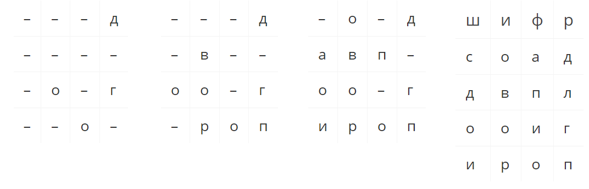
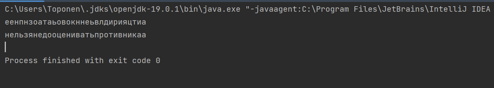
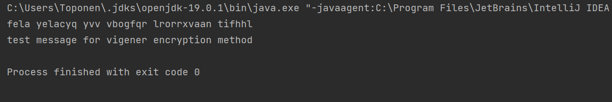

---
## Front matter
title: "Отчет по лабораторной работе по предмету Математические основы защиты информации и информационной безопасности"
subtitle: "Лабораторная работа №2. Шифры перестановки"
author: "Никита Андреевич Топонен"

## Generic otions
lang: ru-RU
toc-title: "Содержание"

## Bibliography
bibliography: bib/cite.bib
csl: pandoc/csl/gost-r-7-0-5-2008-numeric.csl

## Pdf output format
toc: true # Table of contents
toc-depth: 2
lof: true # List of figures
lot: true # List of tables
fontsize: 12pt
linestretch: 1.5
papersize: a4
documentclass: scrreprt
## I18n polyglossia
polyglossia-lang:
  name: russian
  options:
	- spelling=modern
	- babelshorthands=true
polyglossia-otherlangs:
  name: english
## I18n babel
babel-lang: russian
babel-otherlangs: english
## Fonts
mainfont: PT Serif
romanfont: PT Serif
sansfont: PT Sans
monofont: PT Mono
mainfontoptions: Ligatures=TeX
romanfontoptions: Ligatures=TeX
sansfontoptions: Ligatures=TeX,Scale=MatchLowercase
monofontoptions: Scale=MatchLowercase,Scale=0.9
## Biblatex
biblatex: true
biblio-style: "gost-numeric"
biblatexoptions:
  - parentracker=true
  - backend=biber
  - hyperref=auto
  - language=auto
  - autolang=other*
  - citestyle=gost-numeric
## Pandoc-crossref LaTeX customization
figureTitle: "Рис."
tableTitle: "Таблица"
listingTitle: "Листинг"
lofTitle: "Список иллюстраций"
lotTitle: "Список таблиц"
lolTitle: "Листинги"
## Misc options
indent: true
header-includes:
  - \usepackage{indentfirst}
  - \usepackage{float} # keep figures where there are in the text
  - \floatplacement{figure}{H} # keep figures where there are in the text
---

# Цель работы

Цель работы --- познакомиться с шифрами перестановки.

# Задание

1. Реализовать маршрутное шифрование.
2. Реализовать шифрование с помощью решеток.
3. Реализовать шифрование с помощью таблицы Виженера.

# Теоретическое введение

## Маршрутное шифрование

Пусть m и n – некоторые натуральные (т.е. целые положительные) числа, каждое больше 1. Открытый текст последовательно разбивается на части (блоки) с длиной, равной произведению mn (если в последнем блоке не хватает букв, можно дописать до нужной длины произвольный их набор). Блок вписывается построчно в таблицу размерности m×n (т.е. m строк и n столбцов). Криптограмма получается выписыванием букв из таблицы в соответствии с некоторым маршрутом. Этот маршрут вместе с числами m и n составляет ключ шифра.

Чаще всего буквы выписывают по столбцам, которые упорядочиваются в соответствии с паролем: под таблицей подписывается слово, состоящее из n неповторяющихся букв, и столбцы таблицы нумеруются по алфавитному порядку букв пароля.

## Шифрование с помощью решеток

Этот способ шифрования предложил в 1881 году австрийский криптограф Эдуард Флейснер. Выбирается натуральное число k > 1, и квадрат размерности k×k построчно заполняется числами 1, 2, ..., k. Для примера возьмем k = 2.

Квадрат поворачивается по часовой стрелке на 90° и размещается вплотную к предыдущему квадрату. Аналогичные действия совершаются еще два раза, так чтобы в результате из четырех малых квадратов образовался один большой с длиной стороны 2k.

Далее из большого квадрата вырезаются клетки с числами от 1 до k2, для каждого числа одна клетка. Процесс шифрования происходит следующим образом. Сделанная решетка (квадрат с прорезями) накладывается на чистый квадрат 2k×2k и в прорези по строчкам (т.е. слева направо и сверху вниз) вписываются первые буквы открытого текста. Затем решетка поворачивается на 90° по часовой стрелке и накладывается на частично заполненный квадрат, вписывание продолжается.

После третьего поворота, наложения и вписывания все клетки квадрата будут заполнены. Правило выбора прорезей гарантирует, что при заполнении квадрата буква на букву никогда не попадет. Из заполненного квадрата буквы можно выписать по столбцам, выбрав подходящий пароль.

Например, с использованием изображенной выше решетки и пароля ш и ф р открытый текст договор подписали переводится в криптограмму за пять шагов:

{#fig:001 width=70%}

## Таблица Виженера

Французский криптограф Блез Виженер (1523-1596) опубликовал свой метод в «Трактате о шифрах» в 1585 году. С тех пор на протяжении трех столетий шифр Виженера считался нераскрываемым, пока с ним не справился австриец Фридрих Казиски (в 1863 году). При этом способе шифрования открытый текст разбивается на блоки некоторой длины n. Задается ключ – последовательность из n натуральных чисел: a1,a2,...,an. Затем в каждом блоке первая буква циклически сдвигается вправо по алфавиту на a1 позиций, вторая буква – на a2 позиций, ..., последняя – на an шагов.

Для лучшего запоминания, в качестве ключа обычно берут осмысленное слово, и алфавитные номера составляющих его букв используют для вычислений, связанных со сдвигами.

Из-за нехватки опытных шифровальщиков шифр Виженера с длиной блока, равной всего лишь 3, применялся в низовых звеньях русской армии в 1916 году, во время наступления Юго-Западного фронта против австро-венгерской армии – знаменитого брусиловского прорыва. Противник легко читал русские оперативные шифровки, что, в конце концов, и не позволило генералу Брусилову добиться стратегического успеха в блестяще задуманной операции.

# Выполнение лабораторной работы

## Маршрутное шифрование

В рамках данной лабораторной работы я реализовал маршрутное шифрование на языке Java. Ниже приведен код с подробными комментариями:

```java
public class Routing {
    public static void main(String[] args) {
        // Вводим начальные данные
        int n = 6;
        int m = 5;
        String message = "нельзя недооценивать противника";
        String password = "пароль";

        // Кодируем сообщение и выводим его для проверки
        String encryptedMessage = encrypt(n, m, password, message);
        System.out.println(encryptedMessage);

        // Расшифровываем сообщение и выводим для проверки
        String decryptedMessage = decrypt(encryptedMessage, n, m, password);
        System.out.println(decryptedMessage);
    }

    // ====================================================================
    // = Implementation
    // ====================================================================

    // Метод для шифрования
    private static String encrypt(int n, int m, String password, 
        String message) {
        // Убираем пробелы
        String preparedMessage = message.replaceAll(" ", "");
        // Добавляем символы, так чтобы последняя строка была длинной m
        int charactersToAdd = preparedMessage.length() % (n * m);
        preparedMessage = preparedMessage + "а".repeat(charactersToAdd);

        // Создаем таблицу, ключи которой упорядоченны по алфавитному порядку
        // В значения будем записывать строки столбцов таблицы для ключа
        Map<Character, String> encryptionTable = new TreeMap<>();
        for (int i = 0; i < n; i++) {
            encryptionTable.put(password.charAt(i), 
                getCharactersByPosition(preparedMessage, i, n, m));
        }

        // Возвращаем "склеенные" строки зашифрованной таблицы
        return String.join("", encryptionTable.values());
    }

    // Метод для получения столбца таблицы
    private static String getCharactersByPosition(String string, 
        int position, int n, int m) {
        StringBuilder result = new StringBuilder();
        for (int i = 0; i < m; i++) {
            result.append(string.charAt(i * n + position));
        }
        return result.toString();
    }

    // Метод расшифровки сообщения
    private static String decrypt(String encryptedMessage, int n, int m, 
        String password) {
        // Подготовливаем таблицу для расшифровки
        char[] route = password.toCharArray();
        Arrays.sort(route);
        Map<Character, String> decryptionMap = new HashMap<>();
        for (int i = 0; i < password.length(); i++) {
            decryptionMap.put(route[i], 
                encryptedMessage.substring(i * m, i * m + m));
        }

        // Проходим по таблице и воостанавливаем сообщение 
        // по полученной таблице расшифровки
        StringBuilder result = new StringBuilder();
        for (int i = 0; i < m; i++) {
            for (int j = 0; j < n; j++) {
                result.append(decryptionMap.get(password.charAt(j)).charAt(i));
            }
        }

        return result.toString();
    }
}
```

Результаты выполнения программы на иллюстрации (рис. @fig:002).

{#fig:002 width=70%}

## Таблица Виженера

В рамках данной лабораторной работы я реализовал шифрование с помощью таблицы Виженера на языке Java. Ниже приведен код с подробными комментариями:

```java
public class Vigener {
    // Сдвиг. Для английского алфавита 97, для русского 1072
    private static int bias = 0;
    // Количество букв в алфавите. Для английского алфавита 26, для русского 33
    private static int letters = 0;

    public static void main(String[] args) {
        // Задаем свиг и количество букв для английского алфавита
        bias = 97;
        letters = 26;

        // Задаем сообщение и ключ
        String message = "test message for vigener encryption method";
        String key = "mathematics";

        // Кодируем сообщение и выводим его
        String encryptedMessage = encrypt(message, key);
        System.out.println(encryptedMessage);

        // Декодируем сообщение и выводим его
        String decryptedMessage = decrypt(encryptedMessage, key);
        System.out.println(decryptedMessage);
    }

    // =====================================================================
    // = Implementation
    // =====================================================================

    // Метод для кодирования
    private static String encrypt(String text, String key) {
        StringBuilder encrypt = new StringBuilder();
        int keyLen = key.length();
        // Для каждого символа в сообщении
        for (int i = 0; i < text.length(); i++) {
            // Пропускаем пробелы
            if (text.charAt(i) == ' ') {
                encrypt.append(' ');
                continue;
            }
            // Находим символ, сдвинутый вправо на соответствующий номер 
            // символа ключа в алфавите, дописываем его в результат
            encrypt.append((char) (((text.charAt(i) 
                + key.charAt(i % keyLen) - 2 * bias) % letters) + bias));
        }
        // Возвращаем результат
        return encrypt.toString();
    }

    // Метод для декодирования
    private static String decrypt(String cipher, String key) {
        StringBuilder decrypt = new StringBuilder();
        int keyLen = key.length();
        // Для каждого символа в шифре
        for (int i = 0; i < cipher.length(); i++) {
            // Пропускаем пробелы
            if (cipher.charAt(i) == ' ') {
                decrypt.append(' ');
                continue;
            }
            // Находим символ, сдвинутый влево на соответствующий номер 
            // символа ключа в алфавите, дописываем его в результат
            decrypt.append((char) (((cipher.charAt(i) - 
                key.charAt(i % keyLen) + letters) % letters) + bias));
        }
        // Возвращаем результат
        return decrypt.toString();
    }
}
```

Результаты выполнения программы на иллюстрации (рис. @fig:003).

{#fig:003 width=70%}

# Выводы

В рамках данной лабораторной работы я познакомился с шифрами перестановки, такими как маршрутное шифрование, шифрование с помощью решеток и таблица Виженера. Также реализовал шифры на языке Java.

# Список литературы{.unnumbered}