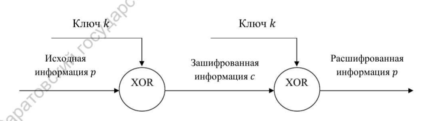
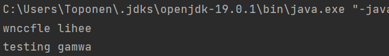

---
## Front matter
lang: ru-RU
title: Лабораторная работа №3
subtitle: Шифрование гаммированием
author:
  - Топонен Н. А.
institute:
  - Российский университет дружбы народов, Москва, Россия
date: 14 октября 2023

## i18n babel
babel-lang: russian
babel-otherlangs: english

## Formatting pdf
toc: false
toc-title: Содержание
slide_level: 2
aspectratio: 169
section-titles: true
theme: metropolis
header-includes:
 - \metroset{progressbar=frametitle,sectionpage=progressbar,numbering=fraction}
 - '\makeatletter'
 - '\beamer@ignorenonframefalse'
 - '\makeatother'
---

# Информация

## Докладчик

:::::::::::::: {.columns align=center}
::: {.column width="70%"}

  * Топонен Никита Андреевич
  * студент Российского университет дружбы народов
  * [1132236933@rudn.ru](mailto:1132236933@rudn.ru)
  * <https://github.com/natoponen>

:::
::: {.column width="30%"}


:::
::::::::::::::

# Вводная часть

## Цель работы

- Познакомиться с шифрованием гаммированием.

## Задание

1. Реализовать шифрование гаммированием.

# Теоретическое введение

## Шифрование гаммированием

- Гаммирование, или Шифр XOR, — метод симметричного шифрования, заключающийся в «наложении» последовательности, состоящей из случайных чисел, на открытый текст.



# Выполнение лабораторной работы

## Шифрование гаммированием

```java
    public String encrypt(String text, int key) {
        StringBuilder cryptogram = new StringBuilder();

        key = key % alphabetSize;
        for (int i = 0; i < text.length(); i++) {
            char symbol = text.charAt(i);
            if (symbol == ' ') {
                cryptogram.append(" ");
            } else {
                int index = alphabet.indexOf(symbol);
                index = xor(index, random(key, i)) % alphabetSize;
                cryptogram.append(alphabet.get(index));
            }
        }
        return cryptogram.toString();
    }
```

## Получение псевдослучайных чисел

```java
    private int random(int number, int count) {
        int[] numbers = new int[]{5, 67, 21, 76, 13, 86, 32, 87, 3, 98, 21,
            9, 11, 54, 94, 1, 4, 7, 55, 44, 32, 95, 33, 22, 64, 87, 30, 39,
            65};
        return numbers[(number * count) % numbers.length] % alphabet.size();
    }
```

## Результат



## Выводы

- Познакомился с шифрованием гаммированием.