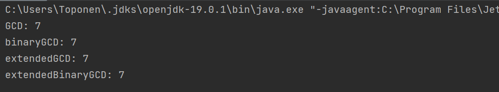

---
## Front matter
lang: ru-RU
title: Лабораторная работа №4
subtitle: Вычисление наибольшего общего делителя
author:
  - Топонен Н. А.
institute:
  - Российский университет дружбы народов, Москва, Россия
date: 26 октября 2023

## i18n babel
babel-lang: russian
babel-otherlangs: english

## Formatting pdf
toc: false
toc-title: Содержание
slide_level: 2
aspectratio: 169
section-titles: true
theme: metropolis
header-includes:
 - \metroset{progressbar=frametitle,sectionpage=progressbar,numbering=fraction}
 - '\makeatletter'
 - '\beamer@ignorenonframefalse'
 - '\makeatother'
---

# Информация

## Докладчик

:::::::::::::: {.columns align=center}
::: {.column width="70%"}

  * Топонен Никита Андреевич
  * студент Российского университет дружбы народов
  * [1132236933@rudn.ru](mailto:1132236933@rudn.ru)
  * <https://github.com/natoponen>

:::
::: {.column width="30%"}


:::
::::::::::::::

# Вводная часть

## Цель работы

- Изучить алгоритмы нахождения наибольшего общего делителя.

## Задание

Реализовать алгоритмы нахождения наибольшего общего делителя:

1. Алгоритм Евклида;
2. Бинарный алгоритм Евклида;
3. Расширенный алгоритм Евклида;
4. Расширенный бинарный алгоритм Евклида.

# Теоретическое введение

## НОД

- Наибольшим общим делителем двух чисел $a$ и $b$ называется наибольшее число, на которое $a$ и $b$ делятся без остатка.

- Например, НОД(4, 16) = 4.

# Выполнение лабораторной работы

## Алгоритм Евклида;

```java
private static long GCD(long a, long b) {
    List<Long> r = new ArrayList<>(List.of(a, b));

    while(r.get(r.size() - 1) != 0) {
        long rPrev = r.get(r.size() - 2);
        long rCurr = r.get(r.size() - 1);
        r.add(rPrev % rCurr);
    }

    return r.get(r.size() - 2);
}
```

## Бинарный алгоритм Евклида ч.1

```java
private static long binaryGCD(long a, long b) {
    long g = 1;
    while (isEven(a) && isEven(b)) {
        a = a / 2;
        b = b / 2;
        g = g * 2;
    }
    long u = a;
    long v = b;
```

## Бинарный алгоритм Евклида ч.2

```java
    while (u != 0) {
        if (isEven(u)) {
            u = u / 2;
        }
        if (isEven(v)) {
            v = v / 2;
        }
        if (u >= v) {
            u = u - v;
        } else {
            v = v - u;
        }
    }
    return g * v;
}
```

## Расширенный алгоритм Евклида ч.1

```java
private static long extendedGCD(long a, long b) {
    List<Long> r = new ArrayList<>(List.of(a, b));
    List<Long> x = new ArrayList<>(List.of(1L, 0L));
    List<Long> y = new ArrayList<>(List.of(0L, 1L));
    long q;
    while (r.get(r.size() - 1) != 0) {
        long rPrev = r.get(r.size() - 2);
        long rCurr = r.get(r.size() - 1);
        long rNext = rPrev % rCurr;
        r.add(rNext);
        q = rPrev / rCurr;
```

## Расширенный алгоритм Евклида ч.2

```java
        if (rNext != 0) {
            long xPrev = x.get(x.size() - 2);
            long xCurr = x.get(x.size() - 1);
            x.add(xPrev - q * xCurr);
            long yPrev = y.get(y.size() - 2);
            long yCurr = y.get(y.size() - 1);
            y.add(yPrev - q * yCurr);
        }
    }
    return r.get(r.size() - 2);
}
```

## Расширенный бинарный алгоритм Евклида ч.1

```java
private static long extendedBinaryGCD(long a, long b) {
    long g = 1;
    while (isEven(a) && isEven(b)) {
        a = a / 2;
        b = b / 2;
        g = 2 * g;
    }
    long u = a;
    long v = b;
    long A = 1;
    long B = 0;
    long C = 0;
    long D = 1;
```

## Расширенный бинарный алгоритм Евклида ч.2

```java
    while (u != 0) {
        while (isEven(u)) {
            u = u / 2;
            if (isEven(A) && isEven(B)) {
                A = A / 2;
                B = B / 2;
            } else {
                A = (A + b) / 2;
                B = (B - a) / 2;
            }
        }
```

## Расширенный бинарный алгоритм Евклида ч.3

```java
        while (isEven(v)) {
            v = v / 2;
            if (isEven(C) && isEven(D)) {
                C = C / 2;
                D = D / 2;
            } else {
                C = (C + b) / 2;
                D = (D - a) / 2;
            }
        }
```

## Расширенный бинарный алгоритм Евклида ч.4

```java
        if (u >= v) {
            u = u - v;
            A = A - C;
            B = B - D;
        } else {
            v = v - u;
            C = C - A;
            D = D - B;
        }
    }
    return g * v;
}
```

## Результат



## Выводы

- Изучил алгоритмы нахождения наибольшего общего делителя.