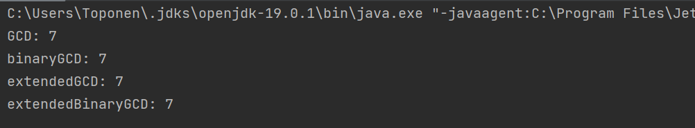

---
## Front matter
title: "Отчет по лабораторной работе по предмету Математические основы защиты информации и информационной безопасности"
subtitle: "Лабораторная работа №4. Вычисление наибольшего общего делителя"
author: "Никита Андреевич Топонен"

## Generic otions
lang: ru-RU
toc-title: "Содержание"

## Bibliography
bibliography: bib/cite.bib
csl: pandoc/csl/gost-r-7-0-5-2008-numeric.csl

## Pdf output format
toc: true # Table of contents
toc-depth: 2
lof: true # List of figures
lot: true # List of tables
fontsize: 12pt
linestretch: 1.5
papersize: a4
documentclass: scrreprt
## I18n polyglossia
polyglossia-lang:
  name: russian
  options:
	- spelling=modern
	- babelshorthands=true
polyglossia-otherlangs:
  name: english
## I18n babel
babel-lang: russian
babel-otherlangs: english
## Fonts
mainfont: PT Serif
romanfont: PT Serif
sansfont: PT Sans
monofont: PT Mono
mainfontoptions: Ligatures=TeX
romanfontoptions: Ligatures=TeX
sansfontoptions: Ligatures=TeX,Scale=MatchLowercase
monofontoptions: Scale=MatchLowercase,Scale=0.9
## Biblatex
biblatex: true
biblio-style: "gost-numeric"
biblatexoptions:
  - parentracker=true
  - backend=biber
  - hyperref=auto
  - language=auto
  - autolang=other*
  - citestyle=gost-numeric
## Pandoc-crossref LaTeX customization
figureTitle: "Рис."
tableTitle: "Таблица"
listingTitle: "Листинг"
lofTitle: "Список иллюстраций"
lotTitle: "Список таблиц"
lolTitle: "Листинги"
## Misc options
indent: true
header-includes:
  - \usepackage{indentfirst}
  - \usepackage{float} # keep figures where there are in the text
  - \floatplacement{figure}{H} # keep figures where there are in the text
---

# Цель работы

Цель работы --- изучить алгоритмы нахождения наибольшего общего делителя.

# Задание

- Реализовать алгоритмы нахождения наибольшего общего делителя:
    1. Алгоритм Евклида;
    2. Бинарный алгоритм Евклида;
    3. Расширенный алгоритм Евклида;
    4. Расширенный бинарный алгоритм Евклида.

# Теоретическое введение

Наибольшим общим делителем двух чисел $a$ и $b$ называется наибольшее число, на которое $a$ и $b$ делятся без остатка. Для записи может использоваться аббревиатура НОД. Для двух чисел можно записать вот так: НОД ($a$, $b$).

Например, для 4 и 16 НОД будет 4. Как мы к этому пришли:

1. Зафиксируем все делители четырех: 4, 2, 1.
2. Все делители шестнадцати: 16, 8, 4 и 1.
3. Выбираем общие: это 4, 2, 1. Самое большое общее число: 4.

Взаимно простые числа — это натуральные числа, у которых только один общий делитель — единица. Их НОД равен 1.

# Выполнение лабораторной работы

## Алгоритм Евклида

В рамках данной лабораторной работы я реализовал алгоритм Евклида на языке Java. Ниже приведен код:

```java
    private static long GCD(long a, long b) {
        if (b <= 0 || b > a) {
            throw new RuntimeException("Cannot calculate GCD if b <= 0 or b > a");
        }

        List<Long> r = new ArrayList<>(List.of(a, b));

        while(r.get(r.size() - 1) != 0) {
            long rPrev = r.get(r.size() - 2);
            long rCurr = r.get(r.size() - 1);
            r.add(rPrev % rCurr);
        }

        return r.get(r.size() - 2);
    }
```

## Бинарный алгоритм Евклида

В рамках данной лабораторной работы я реализовал бинарный алгоритм Евклида на языке Java. Ниже приведен код:

```java
    private static long binaryGCD(long a, long b) {
        if (b <= 0 || b > a) {
            throw new RuntimeException("Cannot calculate GCD if b <= 0 or b > a");
        }

        long g = 1;

        while (isEven(a) && isEven(b)) {
            a = a / 2;
            b = b / 2;
            g = g * 2;
        }

        long u = a;
        long v = b;

        while (u != 0) {
            if (isEven(u)) {
                u = u / 2;
            }

            if (isEven(v)) {
                v = v / 2;
            }

            if (u >= v) {
                u = u - v;
            } else {
                v = v - u;
            }
        }

        return g * v;
    }
```

## Расширенный алгоритм Евклида

В рамках данной лабораторной работы я реализовал расширенный алгоритм Евклида на языке Java. Ниже приведен код:

```java
    private static long extendedGCD(long a, long b) {
        if (b <= 0 || b > a) {
            throw new RuntimeException("Cannot calculate GCD if b <= 0 or b > a");
        }

        List<Long> r = new ArrayList<>(List.of(a, b));
        List<Long> x = new ArrayList<>(List.of(1L, 0L));
        List<Long> y = new ArrayList<>(List.of(0L, 1L));
        long q;

        while (r.get(r.size() - 1) != 0) {
            long rPrev = r.get(r.size() - 2);
            long rCurr = r.get(r.size() - 1);
            long rNext = rPrev % rCurr;
            r.add(rNext);
            q = rPrev / rCurr;
            if (rNext != 0) {
                long xPrev = x.get(x.size() - 2);
                long xCurr = x.get(x.size() - 1);
                x.add(xPrev - q * xCurr);
                long yPrev = y.get(y.size() - 2);
                long yCurr = y.get(y.size() - 1);
                y.add(yPrev - q * yCurr);

            }
        }

        return r.get(r.size() - 2);
    }
```

## Расширенный бинарный алгоритм Евклида

В рамках данной лабораторной работы я реализовал расширенный бинарный алгоритм Евклида на языке Java. Ниже приведен код:

```java
    private static long extendedBinaryGCD(long a, long b) {
        if (b <= 0 || b > a) {
            throw new RuntimeException("Cannot calculate GCD if b <= 0 or b > a");
        }

        long g = 1;

        while (isEven(a) && isEven(b)) {
            a = a / 2;
            b = b / 2;
            g = 2 * g;
        }

        long u = a;
        long v = b;
        long A = 1;
        long B = 0;
        long C = 0;
        long D = 1;

        while (u != 0) {
            while (isEven(u)) {
                u = u / 2;
                if (isEven(A) && isEven(B)) {
                    A = A / 2;
                    B = B / 2;
                } else {
                    A = (A + b) / 2;
                    B = (B - a) / 2;
                }
            }
            while (isEven(v)) {
                v = v / 2;
                if (isEven(C) && isEven(D)) {
                    C = C / 2;
                    D = D / 2;
                } else {
                    C = (C + b) / 2;
                    D = (D - a) / 2;
                }
            }
            if (u >= v) {
                u = u - v;
                A = A - C;
                B = B - D;
            } else {
                v = v - u;
                C = C - A;
                D = D - B;
            }
        }

        return g * v;
    }
```

## Проверка реализации

Для проверки выполнил нахождение НОД(105, 91) всеми алгоритмами. В итоге получил одинаковые ответы.

```java
    public static void main(String[] args) {
        long a = 105L;
        long b = 91L;

        System.out.println("GCD: " + GCD(a, b));
        System.out.println("binaryGCD: " + binaryGCD(a, b));
        System.out.println("extendedGCD: " + extendedGCD(a, b));
        System.out.println("extendedBinaryGCD: " + extendedBinaryGCD(a, b));
    }
```

Результаты выполнения программы на иллюстрации (рис. @fig:001).

{#fig:001 width=70%}

# Выводы

В рамках данной лабораторной работы я изучил алгоритмы нахождения наибольшего общего делителя. Также реализовал алгоритмы на языке Java.

# Список литературы{.unnumbered}