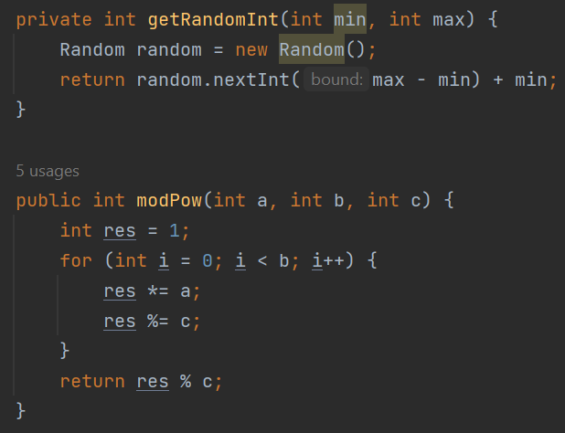
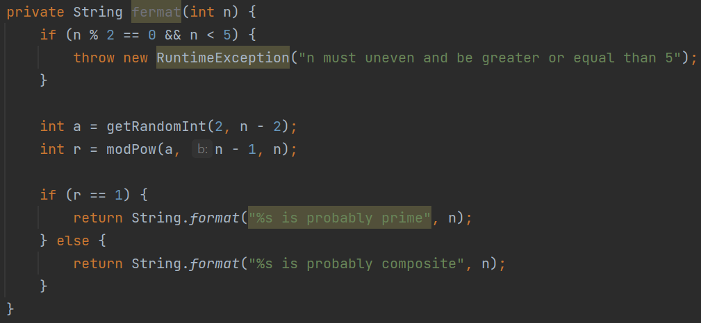
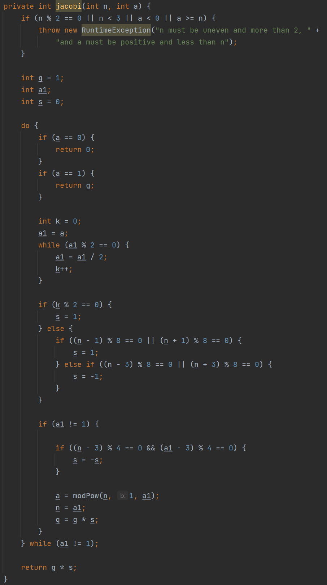
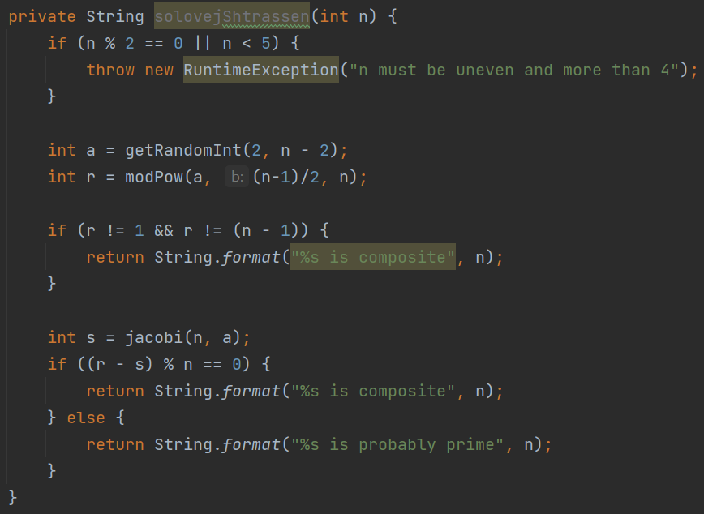
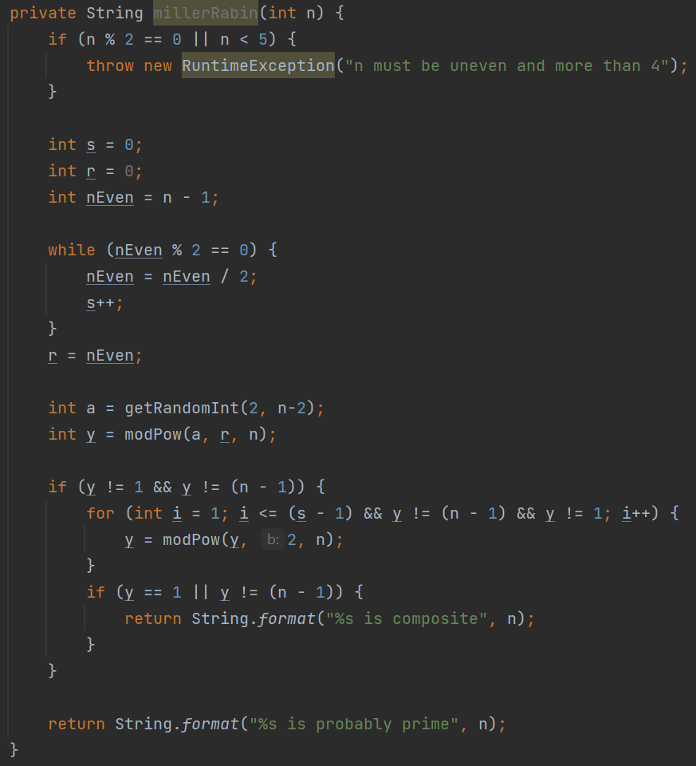

---
## Front matter
lang: ru-RU
title: Лабораторная работа №5
subtitle: Вероятностные алгоритмы проверки чисел на простоту
author:
  - Топонен Н. А.
institute:
  - Российский университет дружбы народов, Москва, Россия
date: 4 ноября 2023

## i18n babel
babel-lang: russian
babel-otherlangs: english

## Formatting pdf
toc: false
toc-title: Содержание
slide_level: 2
aspectratio: 169
section-titles: true
theme: metropolis
header-includes:
 - \metroset{progressbar=frametitle,sectionpage=progressbar,numbering=fraction}
 - '\makeatletter'
 - '\beamer@ignorenonframefalse'
 - '\makeatother'
---

# Информация

## Докладчик

:::::::::::::: {.columns align=center}
::: {.column width="70%"}

  * Топонен Никита Андреевич
  * студент Российского университет дружбы народов
  * [1132236933@rudn.ru](mailto:1132236933@rudn.ru)
  * <https://github.com/natoponen>

:::
::: {.column width="30%"}

:::
::::::::::::::

# Вводная часть

## Цель работы

- Изучить вероятностные алгоритмы проверки чисел на простоту.

## Задание

Реализовать алгоритмы:

1. Алгоритм, реализующий тест Ферма;
2. Алгоритм вычисления символа Якоби;
3. Алгоритм, реализующий тест Соловэя-Штрассена;
4. Алгоритм, реализующий тест Миллера-Рабина.

# Теоретическое введение

## Тест простоты

- Тестом простоты (или проверкой простоты) называется алгоритм, который, приняв на входе число $N$, позволяет либо не подтвердить предположение о том, является ли это число составным, либо точно утверждать его простоту.

1. Тест Ферма.

2. Тест Миллера — Рабина.

3. Тест Соловэя — Штрассена.

4. Тест Бейли — Померанца — Селфриджа — Уогстаффа.

5. Квадратичный тест Фробениуса.

# Выполнение лабораторной работы

## Вспомогательные функции

{width=50%}

## Тест Ферма

{width=90%}

## Вычисления символа Якоби

{width=20%}

## Тест Соловэя — Штрассена

{width=60%}

## Тест Миллера — Рабина

{width=40%}

## Выводы

- Изучил и реализовал вероятностные алгоритмы проверки чисел на простоту.