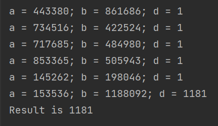

---
## Front matter
lang: ru-RU
title: Лабораторная работа №6
subtitle: Разложение чисел на множители
author:
  - Топонен Н. А.
institute:
  - Российский университет дружбы народов, Москва, Россия
date: 18 ноября 2023

## i18n babel
babel-lang: russian
babel-otherlangs: english

## Formatting pdf
toc: false
toc-title: Содержание
slide_level: 2
aspectratio: 169
section-titles: true
theme: metropolis
header-includes:
 - \metroset{progressbar=frametitle,sectionpage=progressbar,numbering=fraction}
 - '\makeatletter'
 - '\beamer@ignorenonframefalse'
 - '\makeatother'
---

# Информация

## Докладчик

:::::::::::::: {.columns align=center}
::: {.column width="70%"}

  * Топонен Никита Андреевич
  * студент Российского университет дружбы народов
  * [1132236933@rudn.ru](mailto:1132236933@rudn.ru)
  * <https://github.com/natoponen>

:::
::: {.column width="30%"}


:::
::::::::::::::

# Вводная часть

## Цель работы

- Изучить алгоритм поиска нетривиального делителя числа.

## Задание

Реализовать алгоритмы:

- Реализовать алгоритм, реализующий $\rho$-метод Полларда.

# Теоретическое введение

## $\rho$-алгоритм

- $\rho$-алгоритм — предложенный Джоном Поллардом в 1975 году алгоритм, служащий для факторизации (разложения на множители) целых чисел.

- В данной лабораторной работе рассматривается вариация $\rho$-алгоритма, предложенная Флойдом.

# Выполнение лабораторной работы

## Сжимающая функция f

```java
private static Long f(Long x) {
    return x*x + 5;
}
```

## Функция поиска НОД

```java
private static Long GCD(Long a, Long b) {
    if (b == 0) {
        return a;
    }
    return GCD(b, a % b);
}
```

## Реализация $\rho$-метода

```java
    Long a = c;
    Long b = c;
    Long d = 1L;
```

## Реализация $\rho$-метода

```java
    while (d.equals(1L)) {
        a = f(a) % n;
        b = f(f(b)) % n;
        if (b < 0) b += n;
        d = GCD(abs(a - b), n);

        System.out.printf("a = %s; b = %s; d = %s%n", a, b, d);

        if (1 < d && d < n) {
            return d;
        } else if (d.equals(n)) {
            throw new RuntimeException(
                String.format("Divider for %s not found", n));
        }
    }
```

## Результат работы алгоритма



## Выводы

- Изучил и реализовал вероятностные алгоритм поиска нетривиального делителя числа, также известный как $\rho$-метод Полларда.