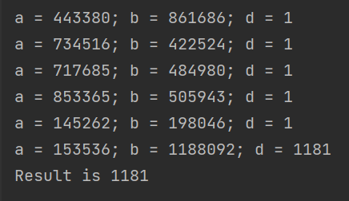

---
## Front matter
title: "Отчет по лабораторной работе по предмету Математические основы защиты информации и информационной безопасности"
subtitle: "Лабораторная работа №6. Разложение чисел на множители"
author: "Никита Андреевич Топонен"

## Generic otions
lang: ru-RU
toc-title: "Содержание"

## Bibliography
bibliography: bib/cite.bib
csl: pandoc/csl/gost-r-7-0-5-2008-numeric.csl

## Pdf output format
toc: true # Table of contents
toc-depth: 2
lof: true # List of figures
# lot: true # List of tables
fontsize: 12pt
linestretch: 1.5
papersize: a4
documentclass: scrreprt
## I18n polyglossia
polyglossia-lang:
  name: russian
  options:
	- spelling=modern
	- babelshorthands=true
polyglossia-otherlangs:
  name: english
## I18n babel
babel-lang: russian
babel-otherlangs: english
## Fonts
mainfont: PT Serif
romanfont: PT Serif
sansfont: PT Sans
monofont: PT Mono
mainfontoptions: Ligatures=TeX
romanfontoptions: Ligatures=TeX
sansfontoptions: Ligatures=TeX,Scale=MatchLowercase
monofontoptions: Scale=MatchLowercase,Scale=0.9
## Biblatex
biblatex: true
biblio-style: "gost-numeric"
biblatexoptions:
  - parentracker=true
  - backend=biber
  - hyperref=auto
  - language=auto
  - autolang=other*
  - citestyle=gost-numeric
## Pandoc-crossref LaTeX customization
figureTitle: "Рис."
tableTitle: "Таблица"
listingTitle: "Листинг"
lofTitle: "Список иллюстраций"
lotTitle: "Список таблиц"
lolTitle: "Листинги"
## Misc options
indent: true
header-includes:
  - \usepackage{indentfirst}
  - \usepackage{float} # keep figures where there are in the text
  - \floatplacement{figure}{H} # keep figures where there are in the text
---

# Цель работы

Цель работы --- изучить алгоритм поиска нетривиального делителя числа.

# Задание

- Реализовать алгоритм, реализующий p-метод Полларда.

# Теоретическое введение

p-алгоритм — предложенный Джоном Поллардом в 1975 году алгоритм, служащий для факторизации (разложения на множители) целых чисел. Данный алгоритм основывается на алгоритме Флойда поиска длины цикла в последовательности и некоторых следствиях из парадокса дней рождения. Алгоритм наиболее эффективен при факторизации составных чисел с достаточно малыми множителями в разложении.

# Выполнение лабораторной работы

## Алгоритм, реализующий p-метод Полларда

В рамках данной лабораторной работы я реализовал алгоритм p-метода Полларда на языке Java. Ниже приведен код:

```java
private static Long pMethod(Long n, Long c) {
    Long a = c;
    Long b = c;
    Long d = 1L;

    while (d.equals(1L)) {
        a = f(a) % n;
        b = f(f(b)) % n;
        if (b < 0) b += n;
        d = GCD(abs(a - b), n);

        System.out.printf("a = %s; b = %s; d = %s%n", a, b, d);

        if (1 < d && d < n) {
            return d;
        } else if (d.equals(n)) {
            throw new RuntimeException(String.format("Divider for %s not found", n));
        }
    }

    return 0L;
}

private static Long f(Long x) {
    return x*x + 5;
}

private static Long GCD(Long a, Long b) {
    if (b == 0) {
        return a;
    }
    return GCD(b, a % b);
}
```

## Проверка работы

С помощью алгоритма нашел нетривиальный делитель числа 1359331, равный 1181:

{#fig:001}

# Выводы

В рамках данной лабораторной работы я изучил и реализовал на языке Java алгоритм поиска нетривиального делителя числа, также известный как p-метод Полларда.

# Список литературы{.unnumbered}